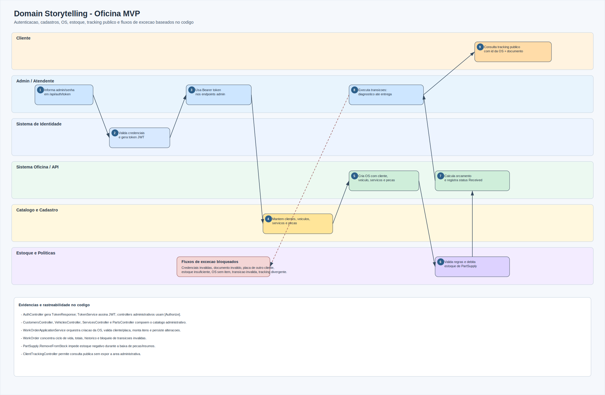
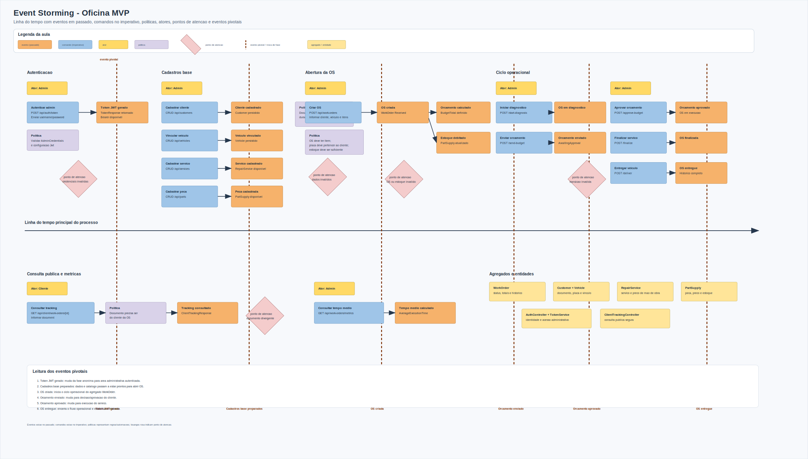

# Documentacao DDD - Tech Challenge Fase 1

Este documento consolida a documentacao pedida no desafio com foco em:

- Domain Storytelling dos fluxos administrativos, operacionais e publicos
- Event Storming dos fluxos de autenticacao, cadastros, OS, estoque, tracking e excecoes
- Linguagem ubiqua com mapeamento PT -> EN para manter rastreabilidade com o codigo

Base de referencia: codigo da aplicacao em `src/OficinaMvp.Api`.

## 1) Escopo e contexto

O MVP implementa um sistema integrado de oficina com os seguintes blocos:

- Identidade e acesso:
  - geracao de token JWT via `POST /api/auth/token`
  - protecao dos endpoints administrativos com `[Authorize]`
- Gestao administrativa autenticada:
  - CRUD de clientes, veiculos, servicos e pecas/insumos
  - criacao e transicao de ordem de servico (OS)
- Consulta publica do cliente:
  - acompanhamento da OS por `id` + `document`
- Dominio central:
  - agregado principal `WorkOrder`
  - entidades de suporte `Customer`, `Vehicle`, `RepairService`, `PartSupply`

## 2) Linguagem ubiqua e glossario PT -> EN

O dominio e explicado em portugues porque esse e o idioma do negocio. O codigo usa nomes em ingles por convencao tecnica. Isso nao cria conflito desde que o mapeamento seja explicito e consistente.

| Termo do negocio (PT) | Nome no codigo (EN) | Significado no dominio | Evidencia |
|---|---|---|---|
| Administrador/Atendente | Admin user | Usuario que autentica e executa operacoes administrativas | `AuthController`, `[Authorize]` |
| Credenciais administrativas | AdminCredentialsOptions | Usuario e senha usados apenas para gerar token | `Infrastructure/Security/AdminCredentialsOptions.cs` |
| Token de acesso | TokenResponse / JWT | Credencial temporaria enviada como `Bearer` nos endpoints protegidos | `AuthController`, `TokenService` |
| Cliente | Customer | Pessoa fisica/juridica identificada por CPF/CNPJ | `Domain/Entities/Customer.cs` |
| Documento | Document | CPF/CNPJ normalizado e validado | `DocumentValidator` |
| Veiculo | Vehicle | Veiculo vinculado a cliente e identificado por placa | `Domain/Entities/Vehicle.cs` |
| Placa | LicensePlate | Identificador unico do veiculo | `LicensePlateValidator` |
| Servico | RepairService | Mao de obra que compoe o orcamento da OS | `Domain/Entities/RepairService.cs` |
| Peca/Insumo | PartSupply | Item de estoque consumido na OS | `Domain/Entities/PartSupply.cs` |
| Estoque | StockQuantity | Quantidade disponivel de uma peca/insumo | `PartSupply.RemoveFromStock()` |
| Ordem de Servico (OS) | WorkOrder | Registro de atendimento com cliente, veiculo, itens, status e historico | `Domain/Entities/WorkOrder.cs` |
| Orcamento | BudgetTotal | Soma de servicos e pecas da OS | `WorkOrder.RecalculateTotals()` |
| Status da OS | WorkOrderStatus | Ciclo: Received -> InDiagnosis -> AwaitingApproval -> InExecution -> Finalized -> Delivered | `WorkOrderStatus.cs` |
| Historico de status | WorkOrderStatusHistory | Registro temporal das transicoes de status | `WorkOrderStatusHistory.cs` |
| Acompanhamento publico | ClientTrackingResponse | Visao publica da OS consultada pelo cliente | `ClientTrackingController` |
| Erro de dominio | DomainException | Violacao de regra de negocio retornada como erro controlado | `ExceptionHandlingMiddleware` |

## 3) Matriz de fluxos documentados

| Fluxo | Ator principal | Endpoint/entrada | Resultado esperado | Regras/excecoes |
|---|---|---|---|---|
| Autenticacao administrativa | Admin/Atendente | `POST /api/auth/token` | JWT gerado | credenciais invalidas retornam `401` |
| Cadastro de cliente | Admin/Atendente | `/api/customers` | `Customer` criado/alterado/listado | documento invalido retorna erro de dominio |
| Cadastro de veiculo | Admin/Atendente | `/api/vehicles` | `Vehicle` vinculado ao cliente | placa invalida ou cliente inexistente bloqueia operacao |
| Cadastro de servico | Admin/Atendente | `/api/services` | `RepairService` disponivel para OS | nome, preco e duracao devem ser validos |
| Cadastro de peca/insumo | Admin/Atendente | `/api/parts` | `PartSupply` disponivel em estoque | preco e estoque nao podem ser negativos |
| Criacao de OS | Admin/Atendente | `POST /api/work-orders` | `WorkOrder` criada com status `Received` | OS sem item, documento invalido, placa de outro cliente ou estoque insuficiente bloqueiam criacao |
| Transicao da OS | Admin/Atendente | `POST /api/work-orders/{id}/...` | status avanca na sequencia operacional | transicao fora da ordem retorna erro de dominio |
| Tracking publico | Cliente | `GET /api/client/work-orders/{id}?document=...` | cliente consulta status e historico | documento divergente retorna `404` |
| Metricas da OS | Admin/Atendente | `GET /api/work-orders/metrics/average-execution-time` | tempo medio de execucao | exige JWT valido |

## 4) Domain Storytelling (visual)

Diagrama:

Narrativas derivadas do codigo:

1. Admin/Atendente informa credenciais e recebe token JWT.
2. Admin usa o token para manter cadastros de cliente, veiculo, servico e peca/insumo.
3. Sistema valida documento, placa, valores de servico, preco e estoque.
4. Admin cria OS com cliente, veiculo, servicos e pecas.
5. Sistema calcula orcamento, debita estoque e registra status inicial `Received`.
6. Admin executa transicoes: diagnostico, envio de orcamento, aprovacao, execucao, finalizacao e entrega.
7. Cliente consulta tracking publico com `workOrderId` e `document`.
8. Fluxos invalidos sao bloqueados por politicas de dominio: credenciais invalidas, documento invalido, placa de outro cliente, estoque insuficiente, OS sem item, transicao invalida e tracking com documento divergente.

## 5) Event Storming (visual)

Diagrama:

### 5.1 Comandos (API)

- Identidade:
  - `POST /api/auth/token`
- Cadastros administrativos:
  - CRUD `/api/customers`
  - CRUD `/api/vehicles`
  - CRUD `/api/services`
  - CRUD `/api/parts`
- Ordem de Servico:
  - `POST /api/work-orders`
  - `POST /api/work-orders/{id}/start-diagnosis`
  - `POST /api/work-orders/{id}/send-budget`
  - `POST /api/work-orders/{id}/approve-budget`
  - `POST /api/work-orders/{id}/finalize`
  - `POST /api/work-orders/{id}/deliver`
  - `GET /api/work-orders/metrics/average-execution-time`
- Tracking publico:
  - `GET /api/client/work-orders/{id}?document=...`

### 5.2 Eventos de dominio observados

- Token JWT gerado
- Cliente cadastrado
- Veiculo vinculado ao cliente
- Servico cadastrado
- Peca/Insumo cadastrado
- OS criada
- Orcamento calculado
- Estoque debitado
- OS em diagnostico
- OS aguardando aprovacao
- OS em execucao
- OS finalizada
- OS entregue
- Tracking consultado pelo cliente

### 5.3 Politicas/regras de negocio

- Endpoints administrativos exigem JWT valido.
- Documento deve ser CPF/CNPJ valido.
- Placa deve ter formato valido.
- Placa nao pode estar vinculada a outro cliente durante a criacao da OS.
- OS deve conter pelo menos um servico ou uma peca/insumo.
- Servicos e pecas informados devem existir.
- Quantidades devem ser maiores que zero.
- Estoque nao pode ficar negativo.
- Transicoes de status devem seguir a sequencia valida.
- Tracking publico exige combinacao valida de `workOrderId` e `document`.

### 5.4 Fluxos de excecao documentados

| Excecao | Politica aplicada | Evidencia no codigo |
|---|---|---|
| Credenciais invalidas | negar token administrativo | `AuthController` |
| Documento invalido | rejeitar cliente, OS ou tracking | `DocumentValidator` |
| Placa invalida | rejeitar cadastro/vinculo de veiculo | `LicensePlateValidator` |
| Placa de outro cliente | impedir criacao de OS inconsistente | `WorkOrderApplicationService` |
| Estoque insuficiente | impedir baixa que deixaria saldo negativo | `PartSupply.RemoveFromStock()` |
| OS sem item | exigir servico ou peca/insumo | `WorkOrder` e `WorkOrderApplicationService` |
| Transicao invalida | preservar ciclo de vida da OS | `WorkOrder.ChangeStatus()` |
| Tracking com documento divergente | nao expor OS de outro cliente | `ClientTrackingController` |

## 6) Bounded contexts praticos no monolito

Mesmo em monolito em camadas, o dominio aparece separado em subareas:

- Identidade e Acesso:
  - foco: token JWT para area administrativa
  - principal: `AuthController` + `TokenService`
- Cadastro e Catalogo:
  - foco: clientes, veiculos, servicos
  - principais: `Customer`, `Vehicle`, `RepairService`
- Estoque:
  - foco: pecas/insumos e saldo
  - principal: `PartSupply`
- Atendimento e Ordem de Servico:
  - foco: lifecycle da OS, orcamento e historico
  - principal: `WorkOrder`
- Tracking Publico:
  - foco: consulta segura do cliente sem expor area administrativa
  - principal: `ClientTrackingController`

## 7) Matriz de aderencia ao desafio (DDD)

| Entregavel solicitado | Evidencia |
|---|---|
| Event Storming dos fluxos de criacao/acompanhamento da OS | `diagramas/event-storming-oficina-mvp.svg` |
| Event Storming da gestao de pecas e insumos | Comandos/eventos/politicas de `PartSupply` e estoque |
| Fluxos administrativos e autenticacao | `POST /api/auth/token` e CRUDs autenticados no Event Storming |
| Diagramas da disciplina de DDD | Domain Storytelling + Event Storming visuais |
| Linguagem ubiqua aplicada | Glossario PT -> EN na secao 2 |
| Baseado na implementacao real | Referencias a controllers, entidades, validators e services |
