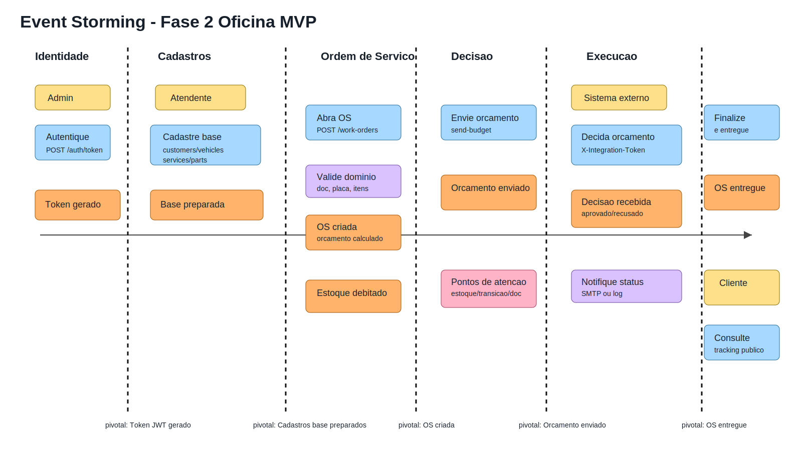
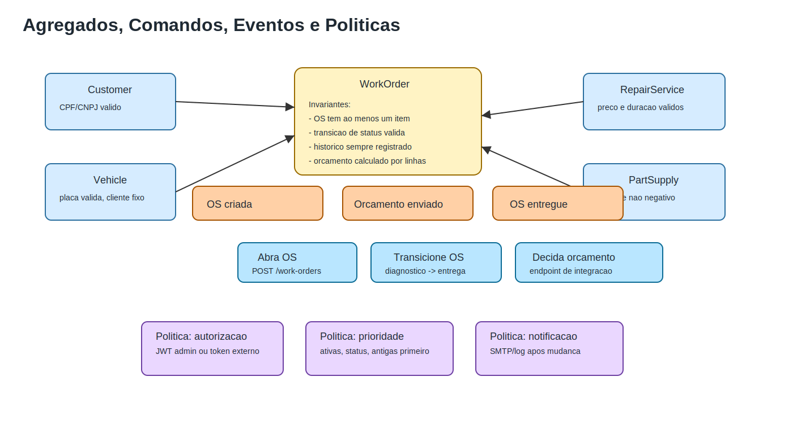
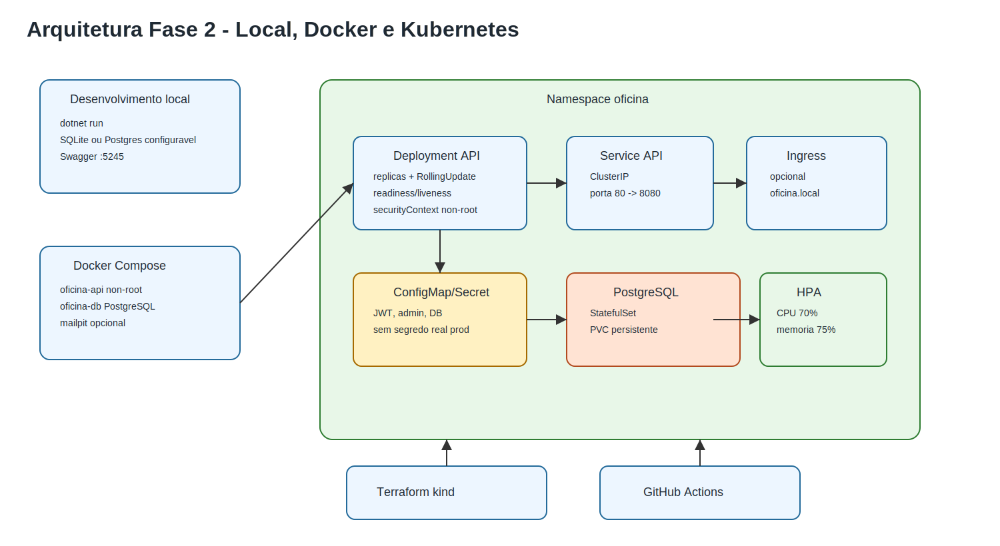

# Documentacao DDD - Tech Challenge Fase 2

Este documento consolida a leitura DDD da versao Fase 2 do projeto Oficina MVP. A base analisada e o codigo atual da solucao, agora organizada em Clean Architecture com projetos `Domain`, `Application`, `Infrastructure` e `Api`.

## 1. Contexto da solucao

A aplicacao resolve o fluxo operacional de uma oficina mecanica:

- administrar clientes, veiculos, servicos e pecas/insumos;
- abrir uma Ordem de Servico (OS) com orcamento automatico;
- controlar estoque de pecas consumidas pela OS;
- conduzir a OS pelos status operacionais;
- expor consulta publica de acompanhamento para o cliente;
- receber decisao externa de orcamento por endpoint de integracao;
- notificar mudancas de status por porta de notificacao configuravel;
- executar localmente, em Docker Compose e em Kubernetes.

## 2. Linguagem ubiqua PT -> EN

O negocio e descrito em portugues. O codigo usa ingles por convencao tecnica. O mapeamento abaixo evita ambiguidade.

| Termo do negocio | Nome no codigo | Papel no dominio |
|---|---|---|
| Administrador/Atendente | Admin user | Usuario autenticado que opera a oficina |
| Credenciais administrativas | AdminCredentialsOptions | Configuracao para gerar JWT administrativo |
| Token de acesso | TokenResponse/JWT | Credencial enviada como `Bearer` nas rotas protegidas |
| Cliente | Customer | Dono do veiculo, identificado por CPF/CNPJ |
| Documento | Document | CPF/CNPJ normalizado e validado |
| Veiculo | Vehicle | Veiculo vinculado a um cliente por placa |
| Placa | LicensePlate | Identificador validado do veiculo |
| Servico | RepairService | Mao de obra que compoe o orcamento |
| Peca/Insumo | PartSupply | Item controlado em estoque |
| Estoque | StockQuantity | Saldo disponivel de peca/insumo |
| Ordem de Servico | WorkOrder | Agregado principal do fluxo operacional |
| Orcamento | BudgetTotal | Soma de servicos e pecas da OS |
| Historico de status | WorkOrderStatusHistory | Linha temporal das mudancas da OS |
| Decisao externa | BudgetDecisionRequest | Aprovacao/recusa recebida por integracao |
| Notificacao de status | IWorkOrderStatusNotifier | Porta para e-mail/log/ferramenta externa |
| Tracking publico | ClientTrackingResponse | Consulta publica por OS + documento |

## 3. Bounded Contexts praticos

A solucao continua sendo um monolito, mas os contextos ficam separados por camadas e responsabilidades.

| Contexto | Responsabilidade | Evidencia no codigo |
|---|---|---|
| Identidade e Acesso | Gerar JWT e proteger rotas administrativas | `AuthController`, `TokenService`, `JwtOptions` |
| Cadastro e Catalogo | Manter clientes, veiculos, servicos e pecas | `WorkshopCatalogApplicationService` |
| Estoque | Validar e baixar saldo de pecas | `PartSupply.RemoveFromStock` |
| Atendimento/OS | Orquestrar abertura, orcamento, status e historico | `WorkOrder`, `WorkOrderApplicationService` |
| Integracao Externa | Receber aprovacao/recusa do orcamento | `WorkOrderBudgetDecisionController` |
| Tracking Publico | Permitir consulta segura do cliente | `ClientTrackingController` |
| Plataforma | Container, Kubernetes, CI/CD e configuracao | `docker-compose.yml`, `k8s/`, `infra/terraform`, `.github/workflows/` |

## 4. Domain Storytelling

Diagrama base:

Narrativa principal:

1. Admin informa credenciais e recebe token JWT.
2. Admin usa o token para cadastrar cliente, veiculo, servico e peca/insumo.
3. Sistema valida documento, placa, valores e estoque.
4. Admin abre a OS com cliente, veiculo, servicos e pecas.
5. Sistema calcula orcamento, debita estoque e registra `Received`.
6. Admin inicia diagnostico, envia orcamento, aprova, finaliza e entrega.
7. Integracao externa pode aprovar ou recusar o orcamento por token proprio.
8. Sistema registra historico e dispara notificacao de status.
9. Cliente acompanha a OS por `GET /api/client/work-orders/{id}?document=...`.

Acoes pivotais:

- Token JWT gerado.
- Cadastros base preparados.
- OS criada.
- Orcamento enviado.
- Orcamento aprovado ou recusado por integracao.
- OS finalizada.
- OS entregue.

## 5. Event Storming Fase 2

Diagrama Fase 2:

Legenda:

| Tipo | Cor no diagrama | Regra de escrita |
|---|---|---|
| Ator | amarelo | Quem dispara comando |
| Comando | azul | Imperativo: autentique, cadastre, abra, envie |
| Evento | laranja | Passado: token gerado, OS criada, estoque debitado |
| Politica | roxo | Regra que decide/encaminha |
| Ponto de atencao | rosa | Excecao, risco ou restricao |
| Evento pivotal | linha vertical | Mudanca de fase/contexto |

Fluxo de eventos:

1. Credenciais informadas -> Token JWT gerado.
2. Cliente cadastrado -> Veiculo vinculado -> Servico cadastrado -> Peca cadastrada.
3. OS criada -> Orcamento calculado -> Estoque debitado.
4. Diagnostico iniciado -> Orcamento enviado.
5. Decisao externa recebida -> Orcamento aprovado ou recusa registrada.
6. OS em execucao -> OS finalizada -> OS entregue.
7. Status consultado pelo cliente -> historico retornado.

Eventos pivotais:

- `Token JWT gerado`
- `Cadastros base preparados`
- `OS criada`
- `Orcamento enviado`
- `Decisao de orcamento recebida`
- `OS entregue`

## 6. Agregados e politicas

Diagrama:

Agregado principal:

- `WorkOrder`
- Invariantes:
  - OS deve conter servico ou peca.
  - Status so pode seguir transicoes validas.
  - Orcamento e calculado a partir das linhas da OS.
  - Historico registra toda mudanca relevante.

Entidades de suporte:

- `Customer`: documento valido e nome obrigatorio.
- `Vehicle`: placa valida e vinculo com cliente.
- `RepairService`: preco e duracao validos.
- `PartSupply`: estoque e preco nao negativos; baixa nao pode gerar estoque negativo.

Politicas relevantes:

- Rotas administrativas exigem JWT.
- Integracao externa exige `X-Integration-Token`.
- Listagem administrativa de OS mostra apenas ativas.
- Ordenacao da listagem prioriza `InExecution`, `AwaitingApproval`, `InDiagnosis`, `Received` e depois OS mais antigas.
- Recusa de orcamento registra historico e mantem a OS aguardando aprovacao, preservando os status exigidos.
- Notificador e porta da Application; infraestrutura decide se envia por SMTP ou apenas loga.

## 7. Arquitetura de plataforma

Diagrama:

Decisoes:

- SQLite permanece para execucao local simples e testes em memoria.
- Docker Compose e Kubernetes usam PostgreSQL para permitir escalabilidade horizontal da API.
- API roda como container non-root.
- Configuracoes nao sensiveis ficam em ConfigMap.
- Valores sensiveis ficam em Secret ou variaveis externas, sem segredo real de producao versionado.
- Probes expostos:
  - `/health/live`
  - `/health/ready`
- HPA escala a API por CPU e memoria.
- Terraform provisiona cluster local `kind` para reprodutibilidade academica.

## 8. Matriz de rastreabilidade

| Requisito Fase 2 | Implementacao | Validacao |
|---|---|---|
| Clean Architecture | Projetos `Domain`, `Application`, `Infrastructure`, `Api` | `dotnet build` |
| Clean Code | Controllers usam services; dominio isolado de EF/API | Build sem warnings |
| Abertura de OS | `POST /api/work-orders` | Testes de integracao |
| Consulta de status | `GET /api/work-orders/{id}/status` | `Phase2WorkOrderRequirementsTests` |
| Aprovacao/recusa externa | `POST /api/integrations/work-orders/{id}/budget-decision` | Testes com/sem token |
| Listagem ativa ordenada | `WorkOrderApplicationService.ListAsync` | Teste de ordenacao/prioridade |
| Excluir finalizadas/entregues | filtro da listagem de OS | Teste de integracao |
| Notificacao por ferramenta externa | `IWorkOrderStatusNotifier` + SMTP/log | Testes de fluxo e config Compose |
| Dockerfile atualizado | runtime non-root e porta 8080 | `docker compose config` + smoke Compose com `/health/ready` e Swagger |
| Kubernetes | manifests em `k8s/` | `kubectl kustomize ./k8s` |
| ConfigMap/Secret | `kustomization.yaml` e `secret.example.yaml` | renderizacao kustomize |
| HPA | `k8s/hpa.yaml` | `kubectl get hpa` em cluster |
| Terraform | `infra/terraform` com kind | `terraform init -backend=false`, `terraform validate`, `terraform plan` |
| CI/CD | workflows GitHub Actions | execucao em PR/main |
| Cobertura critica >= 80% | script `validate-domain-coverage.ps1` | 87.82% dominio, 83.72% integracao |
| Seguranca | SCA NuGet, SAST Semgrep e Docker Scout | Relatorio Markdown/PDF em `security-report/` |

## 9. Pontos de atencao

- Docker/Kubernetes nao devem usar SQLite com multiplas replicas; por isso foi adotado PostgreSQL nesses ambientes.
- O Ingress e opcional para execucao local; `port-forward` e o caminho mais simples para validacao.
- HPA exige metrics-server no cluster.
- Terraform nao esta embutido no repositorio; precisa estar instalado na maquina/CI.
- O scan de imagem depende do Docker daemon ativo e autenticacao no Docker Desktop.
- O scan de 2026-07-13 encontrou `0` achados SCA, `0` achados Semgrep e `1` CVE medium de imagem base sem fix disponivel.

